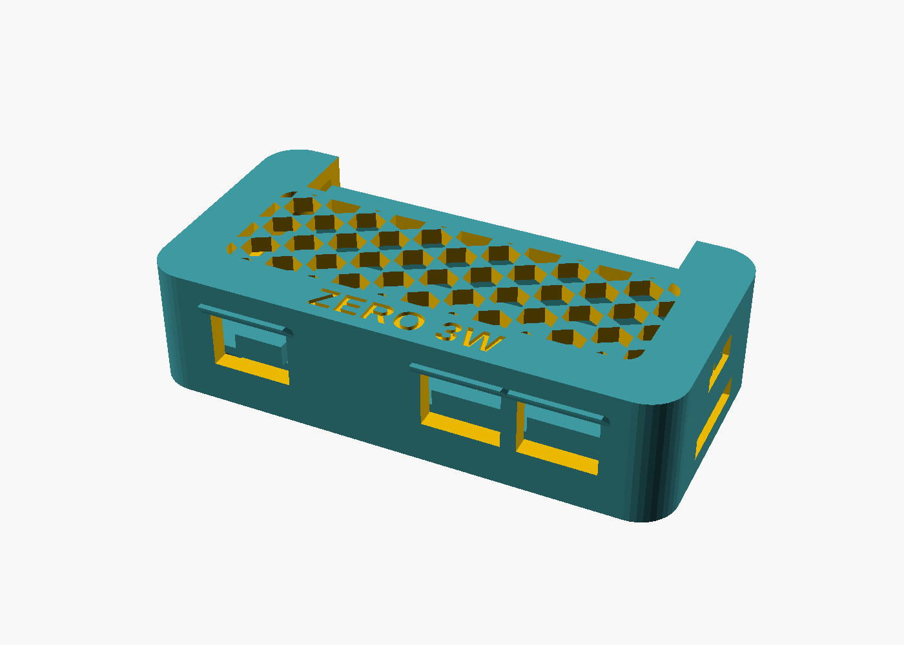
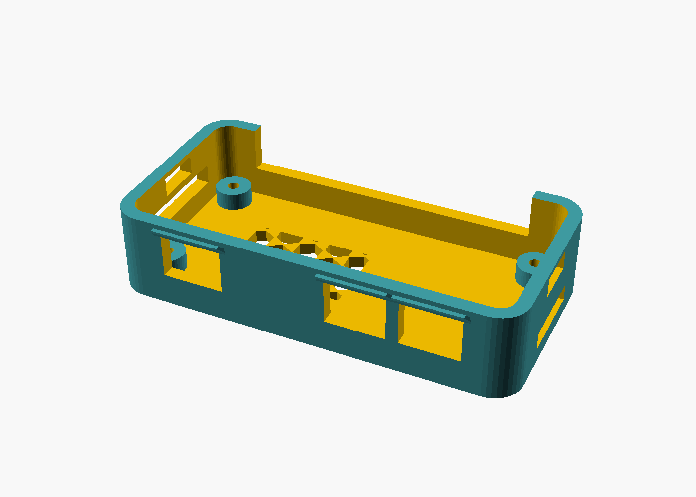
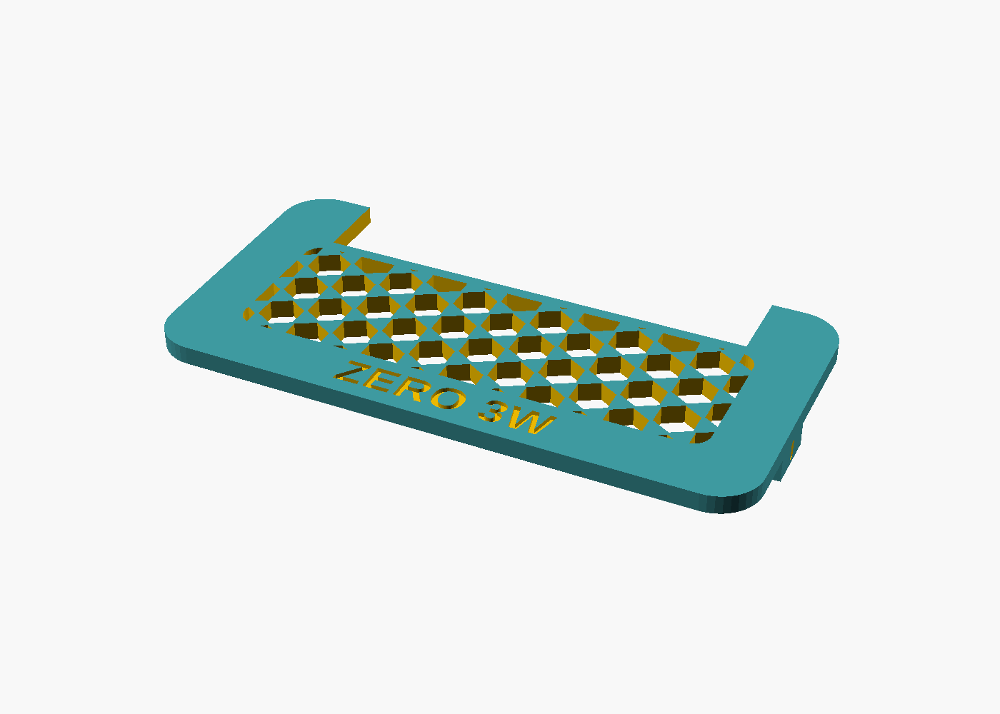
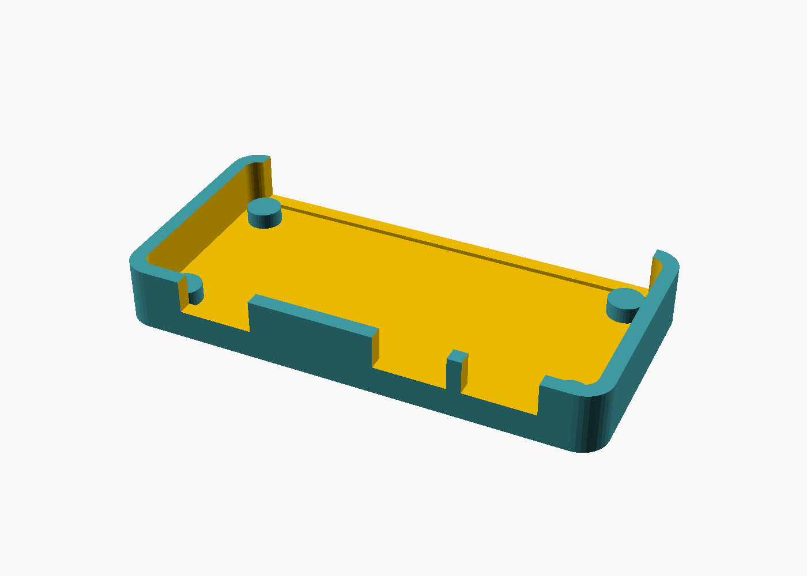

# START HERE — Ender 3 V3 SE prints

Printer arrives tomorrow. This folder is the pile.

This folder is the **3d_Printing** repo on HAL2026 (`Documents/3d_Printing`), not Atom-Code or Atom Chat.

```bash
cd ~/Documents/3d_Printing
git pull origin main
```

Then open `PRINTS/START-HERE.md`.

**Hive** is two parts: base + lid. The board sits on four bosses and is held with **M2.5 screws**. The lid snaps on at the short ends.

## Filament on the shelf

| | |
|---|---|
| Printer | Ender-3 V3 SE — **one extruder, one nozzle** |
| On hand | **2× black PLA**, **2× white PLA** |
| Two colors? | Not in one job. Print the **base in black** and the **lid in white** as two slices, then snap them together. |
| One-plate STL | `zero3w_hive-print.stl` is **one color only** (all black or all white). Do not use it if you want two-tone. |
| Pause-and-swap | Possible (M600 at a layer) but messy. Not worth it for Hive. |

The old blue/orange previews were OpenSCAD’s cutaway colors, not a second filament. Renders below are the actual PLA.

## Tomorrow, in this order

1. **Fit coupon first** (~15 min, little filament)  
   `PRINTS/stl/zero3w_coupon.stl`  
   Drop the real ZERO 3W in. Try **micro HDMI** (left), USB 3.0 Host, and USB 2.0 OTG (**power**).  
   The left hole is sized for the **cable’s plastic housing**, not just the 6.5 mm metal. Typical Type-D overmolds are ~11 mm wide, so that opening will look close to the USB-C holes. That is required for the plug to seat.  
   If the plugs line up, print Hive. If they don’t, stop — don’t print the full case.

2. **Hive case**  
   `PRINTS/stl/zero3w_hive-base.stl`  
   `PRINTS/stl/zero3w_hive-lid.stl`  
   Board onto the four bosses, **M2.5 through the PCB into the 2.1 mm pilots** (6–8 mm screws, thread-form into the plastic). Lid snaps — **one clip on each short end**. To open, press the barb in through the window on the outside of each end, then lift.

One-plate file: `PRINTS/stl/zero3w_hive-print.stl`.

Hardware: **4 × M2.5**, 6–8 mm, pan or button head. The pilots are 2.1 mm so the screw cuts its own thread. Lid has no screw holes.

## Slice (Ender 3 V3 SE, 0.4 mm nozzle)

| | Coupon | Hive base / lid |
|---|---|---|
| Material | White PLA (on the shelf) | Black PLA base, white PLA lid (two jobs). PETG later if the board runs hot. |
| Layer | 0.20 mm | 0.20 mm |
| Walls | 3 | 3 |
| Infill | 15% | 20% gyroid |
| Supports | None | None |
| Orientation | as exported | as exported |

Do not print until the slicer layer view looks right.

## Source

| File | What it is |
|---|---|
| `zero3w_board.scad` | Official v1.11 DXF coordinates. Shared by coupon + Hive. |
| `zero3w_coupon.scad` | Open tray. First print. |
| `zero3w_hive.scad` | Lattice lid, end snaps, visors, M2.5 bosses. `part` = `preview` / `base` / `lid` / `print`. |

```bash
cd PRINTS
openscad -D 'part="lid"' -o stl/zero3w_hive-lid.stl zero3w_hive.scad
```

## Previews

Black PLA base, white PLA lid, white PLA coupon. Green is the dummy PCB, not filament.









## The other case

Measured screw-together tray: [`cad/radxa-zero-3w-case/`](../cad/radxa-zero-3w-case/)
